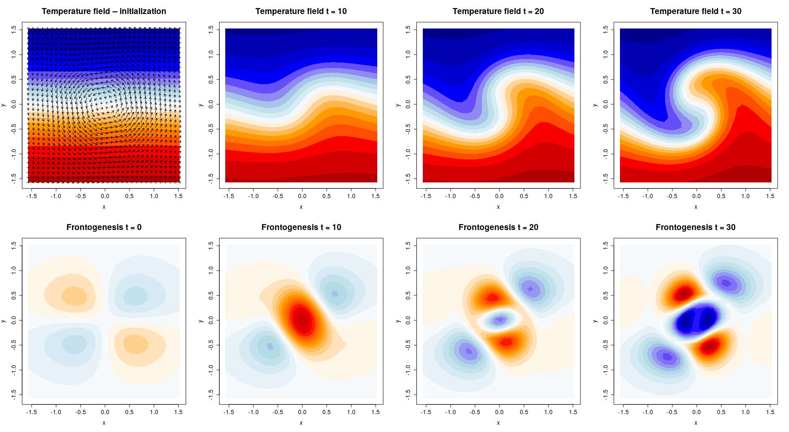

# Doswell Vortex
The Doswell vortex (Doswell, 1984) is a simple idealized numerical experiment that shows how a nondivergent vortex (Rankine combined vortex) interacts with an initially straight frontal zone. In terms of atmospheric dynamics, this experiment shows that the occlusion process does not result from "cath-up" (i.e., the cold front catches up with the warm front as it moves faster), but from "wrap-up". Doswell thus refuted one of the central ideas of the Norwegian cyclone model (Bjerknes and Solberg, 1922) regarding the occlusion process. A detailed description of the occlusion process and the revision of the Norwegian cyclone model can be found in the review (Schultz and Vaughan, 2011). The Doswell vortex can also be extended to baroclinic waves (Schultz and Zhang, 2007).

## Code Description
`calc_doswell.r`: provides the functions for the construction of the Doswell vortex (exactly as in the original paper Doswell, 1984), the necessary numerics and the horizontal frontogenesis function   
`run_examples.r`: initialization of coordinates and temperature field, forward integration and visualization     

**run**: `> run_examples.r`    

  
The plot shows the initial temperature and wind field (upper left), the evolution of the temperature field (upper panels) and the horizontal frontogenesis (lower panels).

## References
- Doswell, C. A. (1984). A Kinematic Analysis of Frontogenesis Associated with a Nondivergent Vortex, J. Atmos. Sci., 41(7):1242-1248.
- Bjerknes, J. und Solberg, H. (1922). Life cycle of cyclones and the polar front theory of atmospheric circulation, Geofys. Publ., 3(1), 3-18.
- Schultz, D. M. und Vaughan, G.(2011). Occluded Fronts and the Occlusion Process. A Fresh Look at Conventional Wisdom, AMS, DOI: 10.1175/2010BAMS3057.1.
- Schultz, D. M. and Zhang, F. (2007). Baroclinic development within zonally-varying flows. Quart. J. Roy. Meteor. Soc., 133, 1101–1112.

 
Contact: laura.mack@fu-berlin.de
